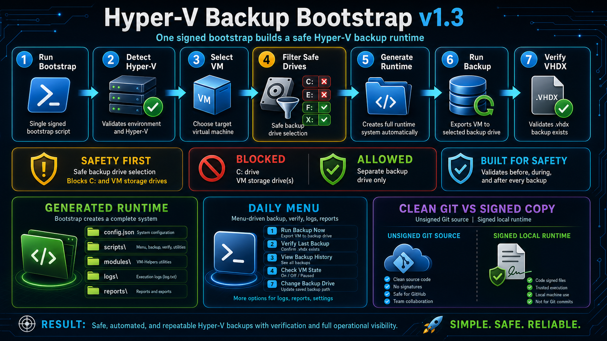

# 🔵 HV-LazyBackup (Bootloader System)

<p align="center">
  
</p>

<p align="center">
  
  
  
  
</p>

---

# 🟢 IMPORTANT CONCEPT

## ⚠️ BOOTLOADER SYSTEM (NOT A SCRIPT COLLECTION)

HV-LazyBackup is a **BOOTLOADER / UNPACKER ENGINE** that installs and generates a full Hyper-V backup system dynamically.

---

# 🟢 ONLY ENTRY FILE

```powershell
.\HV_LazyBackup_Bootstrap_Setup.ps1
```

✔ This is the ONLY file executed manually  
✔ It installs and builds the full system  
✔ It generates all runtime scripts automatically  
❌ It is NOT used for daily backups  

---

# 🧠 SYSTEM ARCHITECTURE

```text
BOOTLOADER (Installer / Unpacker)
        ↓
GENERATED SYSTEM (Scripts + Config)
        ↓
DAILY OPERATIONS (Backup + Verify)
```

---

# 🚀 FULL INSTALLATION FLOW

## 🟢 STEP 1 — DOWNLOAD REPOSITORY

```bash
git clone https://github.com/tcdoverlord/HV-LazyBackup.git
```

---

## 🟢 STEP 2 — OPEN POWERSHELL (ADMIN)

Run PowerShell as Administrator

---

## 🟢 STEP 3 — RUN BOOTLOADER (INSTALL PHASE)

```powershell
cd <REPO_FOLDER>
.\HV_LazyBackup_Bootstrap_Setup.ps1
```

---

# ⚙️ BOOTLOADER EXECUTION (WHAT HAPPENS)

During execution the system is generated dynamically:

## 🖥️ VM DISCOVERY
- Detects Hyper-V environment
- Lists available virtual machines
- User selects target VM

## 💽 DRIVE SELECTION
- User selects backup storage drive
- System drive (C:\) is blocked for safety

## 🧠 SYSTEM GENERATION
Creates full working environment:

```text
C:\HV-LazyBackup\
├── config.json
├── logs\
└── scripts\
    ├── Backup-VM.ps1
    └── Verify-Backup.ps1
```

✔ SYSTEM STATE: READY FOR DAILY OPERATION

---

# 🚀 DAILY OPERATION MODE (POST INSTALL)

## 🧠 SYSTEM STATE MODEL

- BOOTLOADER = INSTALL / GENERATE SYSTEM
- SCRIPTS = DAILY BACKUP OPERATIONS
- VERIFY = SAFETY + VALIDATION LAYER

---

## 🟢 STEP 1 — OPEN POWERSHELL (ADMIN)

Always run PowerShell as Administrator

---

## 🟢 STEP 2 — NAVIGATE TO INSTALL FOLDER

```powershell
cd C:\HV-LazyBackup
```

Or custom install path if selected during setup.

---

## 🟢 STEP 3 — RUN BACKUP

```powershell
.\scripts\Backup-VM.ps1
```

What happens:
- VM state checked
- Safe shutdown if needed
- Hyper-V export executed
- Backup written to selected drive

---

## 🟢 STEP 4 — VERIFY BACKUP

```powershell
.\scripts\Verify-Backup.ps1
```

Returns:
- ✅ BACKUP VALID (SAFE)
- ❌ BACKUP FAILED

---

# 📂 BACKUP OUTPUT STRUCTURE (DYNAMIC DRIVE)

The backup location is selected during bootloader setup.

```text
<SELECTED_DRIVE>:\VM_MASTER_BACKUP\VM-NAME-TIMESTAMP\
```

### Example

If user selects `X:` drive:

```text
X:\VM_MASTER_BACKUP\GrizTechW-2026-06-16_12-03\
    .vhdx
    .vmcx
    .vmrs
```

---

# 🛡️ SAFETY LAYER

✔ Admin required  
✔ Hyper-V validation  
✔ Drive protection (C:\ blocked)  
✔ Safe VM shutdown handling  
✔ Backup verification system  

---

# 🔥 DESIGN PRINCIPLE

- Single BOOTLOADER entry point
- Fully dynamic system generation
- No manual script wiring required
- Portable backup framework

---

# ⚠️ STATUS

Release-Safe Bootloader System v1.0

---

# 👨‍💻 AUTHOR

TCDOverLord
v
